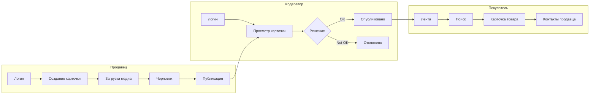

# Домашнее задание №1 — Сбор и анализ требований

**Кейс:** Architectural Kata — сервис объявлений (аналог Avito)  
**Источник кейса:** [Architectural Katas](https://www.architecturalkatas.com)  
**Контекст:** Россия, 2026 год  
**Автор:** Аягжов

---

## 1. Вводные по кейсу

### 1.1. Описание продукта

Сервис объявлений — маркетплейс C2C/B2C, где пользователи публикуют, ищут и просматривают товары и услуги. Платформа объединяет продавцов, покупателей и модераторов.

**Ключевые сущности:**

| Сущность | Описание |
|----------|----------|
| **Лента (Feed)** | Агрегированный поток объявлений для покупателя |
| **Товар (Product / Listing)** | Карточка объявления: заголовок, описание, цена, категория, геолокация |
| **Медиа (Media)** | Фото и видео, привязанные к объявлению |
| **Информация (Info)** | Текстовые метаданные: контакты продавца, статус, дата публикации |

**Роли пользователей:**

| Роль | Доля от DAU | Примерный объём |
|------|-------------|-----------------|
| Покупатель | 84,5% | ~8,5 млн |
| Продавец | 15% | ~1,5 млн |
| Модератор | 0,5% | ~50 тыс. |

**Целевой масштаб:** 10 млн DAU (Daily Active Users).

### 1.2. Уточняющие вопросы к заказчику

| # | Вопрос | Ответ (принятое допущение) |
|---|--------|---------------------------|
| 1 | Какой географический охват? | Вся Россия, основной трафик — Москва и крупные города (МСК+3) |
| 2 | Нужна ли доставка на старте? | Нет, интеграция с логистикой — вне MVP |
| 3 | Какой SLA? | 99,99% (≈52 мин простоя в год) |
| 4 | Есть ли мобильное приложение? | Да, iOS + Android + Web (mobile-first) |
| 5 | Как хранятся персональные данные? | На территории РФ (152-ФЗ) |
| 6 | Сколько фото на объявление? | В среднем 4 изображения, до 10 максимум |
| 7 | Срок жизни объявления? | 30 дней, с возможностью продления |
| 8 | Нужна ли оплата через платформу? | Нет в MVP; контакты продавца отдаются напрямую |

---

## 2. Отсев (Out of Scope)

На этапе MVP **исключаем** функции, которые не критичны для запуска или существенно усложняют архитектуру без пропорциональной ценности.

| Функция | Причина отсева | Когда вернём |
|---------|----------------|--------------|
| Заказ доставки через платформу | Требует интеграций с СДЭК, Почтой России, собственной логистикой; не влияет на core loop «опубликовал → нашёл → связался» | Фаза 2 |
| Рекомендации «похожие товары» (ML) | Требует отдельного ML-пайплайна и данных для обучения; на старте достаточно поиска по категории/гео | Фаза 2 |
| Рейтинг продавцов | Зависит от накопленной истории сделок; на старте нет данных | Фаза 2 |
| Чат покупатель ↔ продавец in-app | Высокая сложность (WebSocket, push, антиспам); на старте — показ телефона/мессенджера | Фаза 2 |
| Жалобы пользователей (complaints) | Модерация «на входе» покрывает основной риск; reactive-жалобы — позже | Фаза 2 |
| Статистика продаж для продавца | Аналитический дашборд — nice-to-have, не блокирует публикацию | Фаза 2 |
| Лайки / избранное | Улучшает retention, но не блокирует основной сценарий | Фаза 1.5 |
| Просмотр других объявлений продавца | Простая фича, но не критична для MVP — можно отложить | Фаза 1.5 |
| Бан аккаунта модератором | Расширенная модерация; на старте достаточно reject объявления | Фаза 1.5 |
| Текстовая причина отклонения | Улучшает UX продавца, но не блокирует модерацию | Фаза 1.5 |
| Чат поддержки для модератора | Отдельный канал коммуникации; на старте — внутренний инструмент | Фаза 2 |

**Итог отсева:** MVP = публикация объявления → модерация → поиск/просмотр → получение контактов продавца.

---

## 3. Scope Refinement (уточнение границ)

### 3.1. MVP (Must Have)

**Покупатель:**
1. Просмотр ленты объявлений (с пагинацией, фильтрами по категории и городу)
2. Поиск по тексту и фильтрам
3. Просмотр карточки товара (фото, описание, цена, геолокация)
4. Получение контактов продавца (телефон / ссылка на мессенджер)
5. Авторизация (опционально для просмотра; обязательна для некоторых действий)

**Продавец:**
1. Авторизация / регистрация
2. Создание карточки товара (заголовок, описание, цена, категория, город)
3. Загрузка фото (до 10 шт.)
4. Сохранение черновика
5. Публикация объявления (отправка на модерацию)

**Модератор:**
1. Авторизация
2. Просмотр карточки на модерации
3. Одобрение (OK) / Отклонение (Not OK)

### 3.2. Фаза 1.5 (Should Have)

- Лайки / избранное
- Просмотр других объявлений продавца
- Бан аккаунта + причина отклонения
- Push-уведомления о статусе модерации

### 3.3. Фаза 2 (Could Have)

- In-app чат
- Доставка
- ML-рекомендации
- Рейтинг продавцов
- Аналитика для продавца
- Escrow-платежи

### 3.4. Диаграмма пользовательских сценариев (MVP)



---

## 4. Функциональные требования (ФТ)

### 4.1. Покупатель

| ID | Требование | Приоритет |
|----|-----------|-----------|
| FR-B-01 | Система отображает ленту объявлений с пагинацией (cursor-based) | Must |
| FR-B-02 | Пользователь может искать объявления по тексту, категории, городу, ценовому диапазону | Must |
| FR-B-03 | Пользователь может просмотреть карточку товара с фото, описанием и ценой | Must |
| FR-B-04 | Пользователь может получить контакты продавца (телефон / мессенджер) | Must |
| FR-B-05 | Система кэширует ленту и результаты поиска для снижения latency | Must |
| FR-B-06 | Пользователь может авторизоваться через телефон + SMS OTP | Must |

### 4.2. Продавец

| ID | Требование | Приоритет |
|----|-----------|-----------|
| FR-S-01 | Продавец может зарегистрироваться / авторизоваться | Must |
| FR-S-02 | Продавец может создать карточку товара с обязательными полями | Must |
| FR-S-03 | Продавец может загрузить до 10 фотографий (JPEG/PNG, max 10 МБ каждая) | Must |
| FR-S-04 | Продавец может сохранить объявление как черновик | Must |
| FR-S-05 | Продавец может отправить объявление на модерацию (публикация) | Must |
| FR-S-06 | Система валидирует контент (размер, формат, запрещённые категории) | Must |
| FR-S-07 | Продавец получает уведомление о результате модерации | Should |

### 4.3. Модератор

| ID | Требование | Приоритет |
|----|-----------|-----------|
| FR-M-01 | Модератор авторизуется через корпоративный IdP | Must |
| FR-M-02 | Модератор видит очередь объявлений на модерацию (FIFO) | Must |
| FR-M-03 | Модератор может одобрить или отклонить объявление | Must |
| FR-M-04 | Система логирует все решения модератора (audit trail) | Must |

### 4.4. Системные

| ID | Требование | Приоритет |
|----|-----------|-----------|
| FR-SYS-01 | Все персональные данные хранятся на территории РФ | Must |
| FR-SYS-02 | API поддерживает версионирование (v1, v2) | Should |
| FR-SYS-03 | Система поддерживает горизонтальное масштабирование всех stateless-компонентов | Must |

---

## 5. Нефункциональные требования (НФТ)

### 5.1. Производительность

| ID | Метрика | Значение | Обоснование |
|----|---------|----------|-------------|
| NFR-P-01 | Peak RPS (read) | ~19 000 | Расчёт в разделе 7 |
| NFR-P-02 | Latency p95 (read) | ≤ 200 мс | UX листинга и поиска |
| NFR-P-03 | Latency p95 (write — публикация) | ≤ 2 000 мс | Upload медиа + запись в БД |
| NFR-P-04 | Latency p95 (модерация) | ≤ 500 мс | Внутренний инструмент, не user-facing |
| NFR-P-05 | Пропускная способность записи на диск | ~1,4 ГБ/с | Загрузка медиа в пик |

### 5.2. Доступность и надёжность

| ID | Метрика | Значение |
|----|---------|----------|
| NFR-A-01 | SLA | 99,99% |
| NFR-A-02 | RPO (потеря данных) | ≤ 1 мин |
| NFR-A-03 | RTO (время восстановления) | ≤ 15 мин |
| NFR-A-04 | Допустимый downtime в год | ≤ 52 мин |

### 5.3. Масштабируемость

| ID | Требование |
|----|-----------|
| NFR-SC-01 | Горизонтальное масштабирование stateless-сервисов (auto-scaling) |
| NFR-SC-02 | Возможность гео-распределения (Multi-DC: Москва + Санкт-Петербург) |
| NFR-SC-03 | Шардирование данных по региону / user_id |
| NFR-SC-04 | CDN для раздачи медиа с edge-узлов в РФ |

### 5.4. Безопасность

| ID | Требование |
|----|-----------|
| NFR-SEC-01 | Соответствие 152-ФЗ (локализация ПДн) |
| NFR-SEC-02 | TLS 1.3 для всех внешних соединений |
| NFR-SEC-03 | Rate limiting на API (защита от DDoS и скрейпинга) |
| NFR-SEC-04 | WAF перед публичным API |
| NFR-SEC-05 | Аудит-лог всех действий модераторов |

### 5.5. Observability

| ID | Требование |
|----|-----------|
| NFR-OBS-01 | Метрики: RPS, latency (p50/p95/p99), error rate по каждому сервису |
| NFR-OBS-02 | Distributed tracing (OpenTelemetry) |
| NFR-OBS-03 | Централизованное логирование (structured JSON logs) |
| NFR-OBS-04 | Алерты при SLA breach (latency > 200ms p95, error rate > 1%) |

---

## 6. Ограничения

### 6.1. Бизнес-ограничения

| # | Ограничение |
|---|------------|
| C-01 | Бюджет на инфраструктуру: ориентир ~50 млн ₽/мес на старте |
| C-02 | Time-to-market MVP: 6 месяцев |
| C-03 | Команда: 3 backend, 2 frontend, 1 mobile, 1 DevOps, 1 QA, 1 PM |
| C-04 | Нет escrow-платежей в MVP — монетизация через рекламу и платное продвижение |

### 6.2. Технические ограничения

| # | Ограничение |
|---|------------|
| C-05 | Персональные данные — только на территории РФ (152-ФЗ) |
| C-06 | Облачная инфраструктура: Yandex Cloud / VK Cloud (ограниченный доступ к AWS/GCP в 2026) |
| C-07 | CDN: Yandex Cloud CDN или отечественный провайдер |
| C-08 | SMS-авторизация через российских операторов (OTP) |
| C-09 | Максимальный размер фото: 10 МБ; форматы: JPEG, PNG, WebP |
| C-10 | Срок хранения объявления: 30 дней (auto-expire) |

### 6.3. Регуляторные ограничения (Россия, 2026)

| # | Ограничение |
|---|------------|
| C-11 | 152-ФЗ — локализация и защита персональных данных |
| C-12 | 149-ФЗ — требования к хранению информации |
| C-13 | Модерация контента (закон о «фейковых» объявлениях, запрещённые категории) |
| C-14 | Импортозамещение: приоритет отечественного ПО в госсекторе и крупных контрактах |

### 6.4. Архитектурные допущения

| # | Допущение |
|---|-----------|
| A-01 | 85% пользователей в часовом поясе МСК (UTC+3) |
| A-02 | Пиковый трафик — вечернее время 19:00–23:00 (60% суточного трафика) |
| A-03 | Средний размер изображения: 5 МБ (после сжатия на клиенте) |
| A-04 | Среднее количество фото на объявление: 4 |
| A-05 | Прогноз роста на 1 год не закладываем (расчёт на текущий DAU) |
| A-06 | TTL для кэша ленты: 60 сек; для карточки товара: 300 сек |

---

## 7. Расчёт нагрузки

### 7.1. Исходные данные

**DAU = 10 000 000**

| Роль | Доля | DAU | Сессий/день | Запросов/сессию | Запросов/день |
|------|------|-----|-------------|-----------------|---------------|
| Покупатель | 84,5% | 8 500 000 | 3 | 19 | 484 500 000 |
| Продавец | 15% | 1 500 000 | 0,2 (~1 раз в 5 дней) | 10 | 3 000 000 |
| Модератор | 0,5% | 50 000 | 1 | 11 | 550 000 |
| **Итого** | 100% | 10 000 000 | — | — | **488 050 000** |

**Детализация запросов покупателя (19 req/сессия):**

| Действие | Запросов | Тип |
|----------|----------|-----|
| Просмотр ленты | 10 | GET (read) |
| Поиск | 5 | GET (read) |
| Просмотр карточки товара | 3 | GET (read) |
| Получение контактов | 1 | GET (read) |

**Детализация запросов продавца (10 req/сессия):**

| Действие | Запросов | Тип |
|----------|----------|-----|
| Логин | 1 | POST |
| Просмотр своих объявлений | 1 | GET |
| Загрузка медиа | 5 | POST (write) |
| Сохранение черновика | 1 | POST |
| Публикация | 2 | POST |

### 7.2. Средний RPS

```
Сутки = 86 400 сек

Покупатели:  484 500 000 / 86 400 ≈ 5 608 RPS
Продавцы:      3 000 000 / 86 400 ≈    35 RPS
Модераторы:      550 000 / 86 400 ≈     6 RPS
─────────────────────────────────────────────
Итого средний:                      ≈ 5 649 RPS
```

### 7.3. Пиковый RPS

**Допущения:**
- 60% дневного трафика приходится на 4-часовое «prime time» окно (19:00–23:00 МСК)
- Коэффициент пик/средний ≈ 3,4×

```
Пиковый трафик = 488 050 000 × 0,6 = 292 830 000 запросов за 4 часа
Пиковое окно   = 4 × 3 600 = 14 400 сек

Peak RPS = 292 830 000 / 14 400 ≈ 20 335 RPS ≈ 20K RPS
```

**Разбивка по типу операций в пик:**

| Тип | Доля | Peak RPS |
|-----|------|----------|
| Read (покупатели) | ~99% | ~19 500 |
| Write (продавцы — upload + publish) | ~0,7% | ~140 |
| Moderation | ~0,3% | ~60 |

> **Вывод:** система read-heavy. Основной bottleneck — чтение ленты и поиск, а не запись объявлений.

### 7.4. Расчёт хранения

#### 7.4.1. Медиа (фото)

```
Новых объявлений/день:
  Продавцы публикуют: 1 500 000 × 0,2 сессий × 1 публикация ≈ 300 000 объявлений/день
  (с учётом повторных публикаций и обновлений — берём ~2,14 млн операций с медиа/день)

Изображений/день:  2 140 000 × 4 фото = 8 560 000 фото
Объём/день:        8 560 000 × 5 МБ = 42,8 ТБ/день
С репликацией ×3:  42,8 × 3 = 128,4 ТБ/день (raw)
```

#### 7.4.2. Метаданные

| Тип данных | Размер записи | Объём/день | С репликацией ×3 |
|-----------|---------------|------------|-------------------|
| Пользователи (10M × 5 КБ) | 5 КБ | ~50 ГБ (единовременно) | ~150 ГБ |
| Объявления (2,14M × 10 КБ) | 10 КБ | ~21,4 ГБ/день | ~64 ГБ/день |
| Логи (488M × 1 КБ) | 1 КБ | ~488 ГБ/день | hot: 7 дней ≈ 3,4 ТБ |

#### 7.4.3. Сводка по хранению

| Компонент | Объём (с репликацией) | Примечание |
|-----------|----------------------|------------|
| Медиа (S3-совместимое хранилище) | ~128 ТБ/день прирост | Lifecycle policy: переход в cold storage через 30 дней |
| Метаданные (PostgreSQL / шарды) | ~64 ГБ/день прирост | Партиционирование по дате |
| Пользователи | ~150 ГБ | Шардирование по user_id |
| Логи | ~3,4 ТБ (rolling 7 дней) | Отправка в cold storage / удаление |

#### 7.4.4. Пропускная способность записи

```
Write throughput (медиа) = 8 560 000 фото × 5 МБ / 86 400 сек
                         ≈ 495 МБ/с (среднее)
                         ≈ 1,4 ГБ/с (в пик, ×3)
```

### 7.5. Пропускная способность сети

| Направление | Среднее | Пик |
|-------------|---------|-----|
| Ingress (upload фото) | ~500 МБ/с | ~1,4 ГБ/с |
| Egress (раздача ленты + CDN) | ~2 ГБ/с | ~6 ГБ/с |

### 7.6. Ключевые узкие места (предварительно)

| # | Bottleneck | Почему |
|---|-----------|--------|
| 1 | **Read path (лента + поиск)** | 99% трафика — GET; 20K RPS на чтение |
| 2 | **Медиа-хранилище** | 128 ТБ/день прирост; нужен CDN + object storage |
| 3 | **Поисковый индекс** | Full-text search по миллионам объявлений |
| 4 | **Очередь модерации** | 300K+ объявлений/день → ~4,3 объявления/модератор/день (при 50K модераторов — запас есть) |

---

## 8. Контекст: Россия, 2026

| Аспект | Влияние на архитектуру |
|--------|----------------------|
| **Облака** | Yandex Cloud / VK Cloud как primary; AWS/GCP — ограниченно |
| **CDN** | Yandex Cloud CDN, EdgeЦентр — для раздачи медиа внутри РФ |
| **ПДн** | 152-ФЗ: все БД и бэкапы на территории РФ |
| **Платежи** | В MVP не нужны; в будущем — СБП, Mir Pay |
| **SMS** | OTP через SMS.ru / SMSC.ru / операторские шлюзы |
| **Модерация** | Усиленные требования к контенту (законодательство 2024–2026) |
| **Мониторинг** | Grafana + Prometheus (self-hosted или Yandex Monitoring) |
