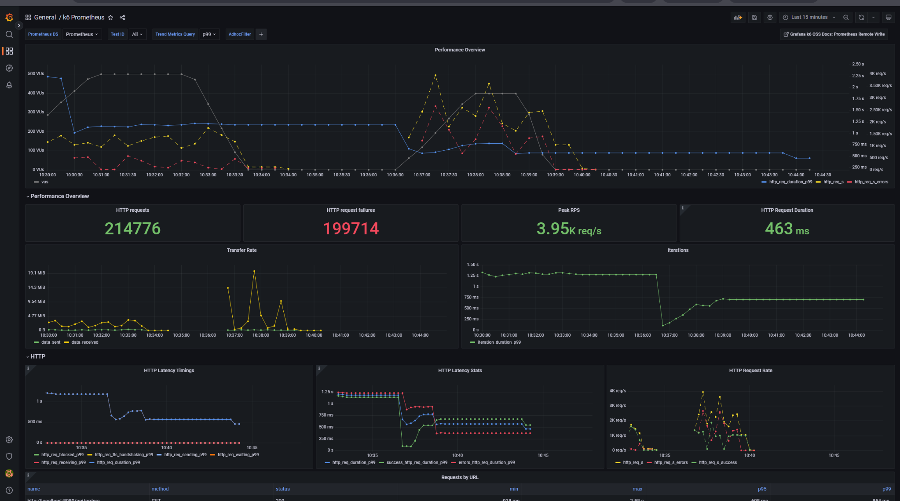
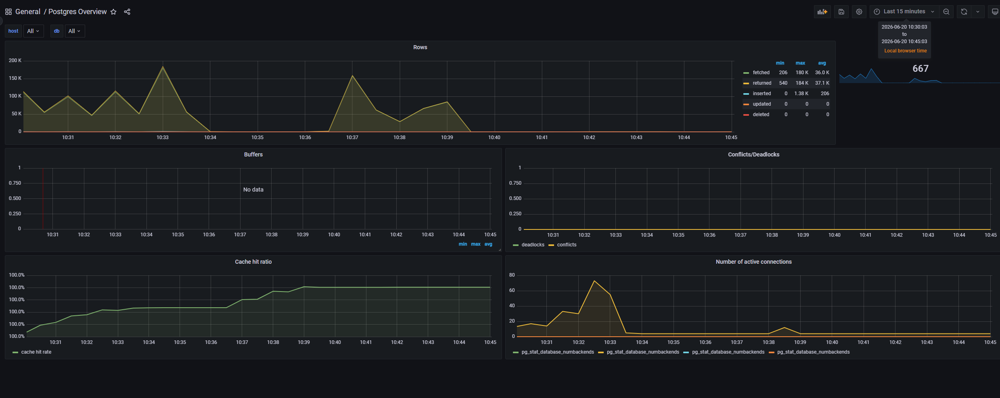
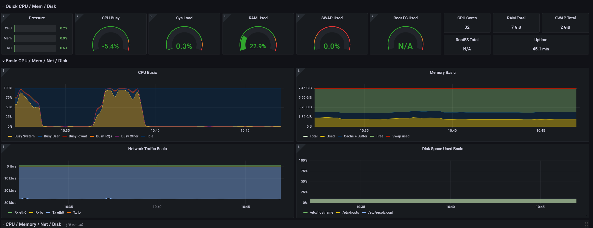

# Practice HW1 — Нагрузочное тестирование demo-app-1

**Автор:** Аягжов  
**Проект:** `code\demo-app-1`  
**ОС:** Windows (PowerShell)  
**Дата прогона:** 20.06.2026

---

## 1. Архитектура и роль компонентов

### 1.1. Схема

```
Browser → Nginx :8080 → Backend Go :8081 → PostgreSQL :5432
                              ↓
                    Prometheus :9090 ← exporters
                              ↓
                         Grafana :3000
                    k6 → remote_write → Prometheus
```

### 1.2. Зачем каждый компонент

| Компонент | Зачем | Что будет без него |
|-----------|-------|-------------------|
| **Nginx** | Reverse proxy: статика (`/`), проксирование API (`/api/`), единая точка входа :8080 | Клиент ходит напрямую в backend; нет разделения static/API |
| **Backend (Go)** | Бизнес-логика, REST API, Prometheus-метрики `/metrics` | Нет приложения |
| **PostgreSQL** | Персистентность users/orders | Нет данных |
| **Prometheus** | Сбор метрик (scrape 15s): backend, postgres, node, cAdvisor | Слепая зона — не видим деградацию |
| **Grafana** | Визуализация, корреляция метрик во времени | Метрики есть, но нечитаемы |
| **k6** | Генерация нагрузки + remote write в Prometheus | Нет воспроизводимого НТ |
| **postgres-exporter** | `pg_stat_activity`, locks, TPS, connections | Не видим состояние БД |
| **node-exporter** | CPU, RAM, disk, network хоста | Не отличим «упёрлись в железо» от «упёрлись в код» |
| **cAdvisor** | CPU/RAM per container | Не видим, какой контейнер жрёт ресурсы |

### 1.3. Поток запроса (POST /api/orders)

1. k6 → `localhost:8081/api/orders` (или через Nginx `8080`)
2. Backend: middleware → histogram `http_request_duration_seconds`
3. SQL INSERT → histogram `db_query_duration_seconds`
4. Counter `http_requests_total{method,path,status}`
5. postgres-exporter фиксирует active connections, locks

---

## 2. Этап №1 — Какие метрики отслеживать

### 2.1. RED-метрики (по сервису)

| Метрика | Источник | Зачем |
|---------|----------|-------|
| **Rate** — RPS | `http_requests_total` | Понять, выдерживает ли система целевую нагрузку |
| **Errors** — error rate | `http_requests_total{status=5xx}` | Деградация под нагрузкой |
| **Duration** — latency p50/p95/p99 | `http_request_duration_seconds` | SLA, UX |

### 2.2. Метрики БД (критично — write-heavy сценарий)

| Метрика | Источник | Зачем |
|---------|----------|-------|
| Active connections | `pg_stat_activity_count` | Connection pool exhaustion |
| Idle vs active | postgres-exporter | Утечка соединений |
| Transaction rate | `pg_stat_database_xact_commit` | Throughput БД |
| Lock waits | `pg_locks_count` | Конкуренция за INSERT |
| Query duration | `db_query_duration_seconds` (backend) | Bottleneck в SQL |

### 2.3. Метрики инфраструктуры

| Метрика | Источник | Зачем |
|---------|----------|-------|
| CPU % per container | cAdvisor / node-exporter | Backend vs DB — кто упёрся |
| Memory | cAdvisor + node | OOM risk |
| Network I/O | node-exporter | Сеть как bottleneck |
| Disk I/O | node-exporter | WAL, INSERT pressure |

### 2.4. Метрики k6

| Метрика | Зачем |
|---------|-------|
| `http_req_duration` p95 | End-to-end latency под нагрузкой |
| `http_req_failed` | % неуспешных запросов |
| `vus` | Текущие виртуальные пользователи |
| `iterations` | Сколько итераций завершено |

### 2.5. Гипотезы до прогона

1. **Шторм (1000 VU за 10s):** PostgreSQL станет bottleneck — connection pool Go `sql.DB` по умолчанию неограничен, но PG `max_connections=200`; ожидаем рост latency и 5xx.
2. **Волна (0→500 за 2min):** Система адаптируется плавно; метрики растут линейно, без резкого error spike.
3. **Read-heavy (95% GET):** Latency ниже, чем в write-heavy; Nginx кэширует мало, но GET дешевле INSERT.

---

## 3. Этап №2 — Сценарии нагрузки

Прогоны выполнены последовательно на Windows (PowerShell), между тестами — пауза ~2 мин.

| # | Сценарий | Скрипт | Время старта |
|---|----------|--------|--------------|
| 1 | Шторм | `storm.js` | 10:26:29 MSK |
| 2 | Волна | `wave.js` | 10:28:51 MSK |
| 3 | Read-heavy | `read-heavy.js` | 10:36:25 MSK |

### 3.1. Сценарий «Шторм»

**Профиль:** 0 → 1000 VU за 10s, плато 1 min, сброс 30s  
**Распределение:** 80% POST `/api/orders`, 20% GET `/api/orders`

### 3.2. Сценарий «Волна»

**Профиль:** 0 → 500 VU за 2 min, плато 2 min, сброс 1 min  
**Распределение:** 80% POST, 20% GET

### 3.3. Сценарий «Read-heavy» (кастомный)

**Профиль:** 0 → 400 VU за 1.5 min, плато 1 min, сброс 30s  
**Фишка:** 95% GET через Nginx `:8080`, 5% POST напрямую в backend `:8081` — проверяем read-path vs write-path.

---

## 4. Этап №3 — Анализ результатов

### 4.1. Сводная таблица (данные k6)

| Сценарий | Peak VU | RPS (средний) | p95 latency | Error rate | Thresholds | Главный bottleneck |
|----------|---------|---------------|-------------|------------|------------|-------------------|
| **Шторм** | 1000 | **1358 req/s** | **2.01 s** | **13.15%** | ✗ duration, ✗ errors | PostgreSQL + backend (write path) |
| **Волна** | 500 | **1099 req/s** | **765 ms** | **15.47%** | ✓ duration, ✗ errors | PostgreSQL (накопленная нагрузка) |
| **Read-heavy** | 400 | **1750 req/s** | **462 ms** | **66.68%** | ✓ duration, ✗ errors | Nginx :8080 (GET `/api/orders`) |

**Итого за все прогоны:** ~744 842 HTTP-запроса (130 268 + 314 105 + 299 469).

### 4.2. Шторм — инсайты

**Результаты k6 (терминал, `storm.js`, старт 10:26:29):**
- 130 268 HTTP-запросов за 1m40s
- RPS: **1358 req/s**
- Checks succeeded: **86.84%** (17 143 failed)
- POST `created`: **86%** — ✓ 90 485 / ✗ 13 611
- GET `list ok`: **86%** — ✓ 22 640 / ✗ 3 532
- Median latency: **184 ms**, max: **35.55 s**
- p95: **2.01 s** — порог `p(95)<2000ms` **не пройден**
- Error rate: **13.15%** — порог `rate<0.05` **не пройден**
- Peak VU по k6: **1000**

**Вывод по шторму:**  
При резком наборе до 1000 VU write-heavy нагрузка деградировала: **13.15% ошибок**, p95 = **2.01 s**. POST и GET показывают одинаковый процент успешных checks (~86%). Контейнеры не падали.

---

### 4.3. Волна — инсайты

**Результаты k6 (терминал, `wave.js`, старт 10:28:51):**
- 314 105 HTTP-запросов за 5m0s
- RPS: **1099 req/s**
- Checks succeeded: **84.52%** (48 617 failed)
- POST `created`: **84%** — ✓ 213 315 / ✗ 38 109
- GET `list ok`: **83%** — ✓ 52 173 / ✗ 10 508
- Median latency: **92 ms**, max: **2.58 s**
- p95: **765 ms** — порог `p(95)<1500ms` **пройден**
- Error rate: **15.47%** — порог `rate<0.02` **не пройден**

**Вывод по волне:**  
Latency лучше, чем у шторма (p95 765 ms vs 2.01 s), но error rate **15.47%** — даже выше шторма. Волна шла сразу после шторма; к моменту пика в таблице `orders` уже сотни тысяч записей.

---

### 4.4. Read-heavy — инсайты

**Результаты k6 (терминал, `read-heavy.js`, старт 10:36:25):**
- 299 469 HTTP-запросов за 3m0s (фактически k6 отработал 2m51s)
- RPS: **1750 req/s**
- Checks succeeded: **33.31%** (199 714 failed)
- GET `list ok` через Nginx `:8080`: **29%** — ✓ 84 693 / ✗ 199 714
- POST `created` напрямую в backend `:8081`: **100%**
- Median latency: **91 ms**, max: **1.6 s**
- p95: **462 ms** — порог `p(95)<500ms` **пройден**
- Error rate: **66.68%** — порог `rate<0.01` **не пройден**

**Сравнение write-heavy vs read-heavy:**

| Метрика | Шторм / Волна | Read-heavy |
|---------|---------------|------------|
| p95 latency | 765 ms – 2.01 s | **462 ms** |
| Error rate | 13.15 – 15.47% | **66.68%** |
| RPS | 1099 – 1358 | **1750** |
| POST `created` | 84 – 86% | **100%** |
| GET `list ok` | 83 – 86% | **29%** |

**Вывод по read-heavy:**  
p95 ниже (462 ms), но error rate намного выше. GET через **Nginx :8080** падает в 71% случаев, POST в **backend :8081** проходит на 100%. Узкое место read-path — **Nginx**, не PostgreSQL.

---

### 4.5. Grafana (Last 15 min — все три прогона на одном окне)

Скриншоты сняты после всех тестов; на графиках видна суммарная картина, а не отдельный прогон.

**k6 Prometheus:**



- На overview VU доходили до **~200**, около 10:36:30 снизились до **~100**
- Peak RPS: **3.95k req/s** (пики около 10:37–10:39)
- HTTP requests за окно: **214 776**, failures: **199 714** — совпадает с числом failed checks в read-heavy
- p99 latency в пиках доходила до **~2.25–2.58 s**
- Средняя длительность запроса на панели: **463 ms**

**PostgreSQL:**



- Первый всплеск rows (10:30–10:34): returned/fetched до **~184K**, inserted max **1.38K** (avg **206**)
- Active connections в первом пике (10:32:30): **~70–75**
- Второй всплеск (10:36–10:40) слабее: connections до **~12–15**
- Deadlocks / conflicts: **0**
- Cache hit ratio: с **~85%** вырос до **100%** к ~10:39

**CPU хоста:**



- CPU Busy: первый пик **~90%** (10:32–10:34), второй **~95–100%** (10:37–10:39)
- RAM Used: **22.9%** (1.86 GiB из 7 GiB)
- **32** CPU cores, uptime **~45 min**

---

## 5. Этап №4 — Решения и рекомендации

### 5.1. Bottleneck: PostgreSQL connections (Шторм, Волна)

**Наблюдение:** на графике Postgres connections доходили до **~75**; в k6 — **13–15%** ошибок на write-heavy.

**Решения:**
1. `db.SetMaxOpenConns(50)` + `SetMaxIdleConns(10)` в backend — ограничить пул
2. **PgBouncer** перед PostgreSQL (transaction pooling)
3. Read replicas для GET-запросов

### 5.2. Bottleneck: Nginx при read-heavy (66% ошибок GET)

**Наблюдение:** POST :8081 — 100% успех, GET :8080 — 29% успех при 1750 RPS.

**Решения:**
1. Увеличить `worker_connections` и `worker_processes` в Nginx
2. Горизонтальное масштабирование: **HAProxy + 3 backend** (`docker-compose-lb.yaml`)
3. Для read-heavy в проде — CDN / кэш перед API

### 5.3. Bottleneck: накопление данных в `orders`

**Наблюдение:** после шторма **90 485** успешных INSERT; волна показала худший error rate (**15.47%** vs **13.15%**).

**Решения:**
1. Партиционирование таблицы `orders` по дате
2. Индексы на `created_at` для `ORDER BY ... DESC LIMIT 100`
3. Между НТ-прогонами — `TRUNCATE orders` или отдельная тестовая БД

### 5.4. Bottleneck: нет backpressure

**Наблюдение:** k6 продолжает слать запросы при 13–66% ошибок.

**Решения:**
1. Rate limiting в Nginx (`limit_req_zone`)
2. Circuit breaker в backend
3. Auto-scaling (K8s HPA)

### 5.5. HAProxy — горизонтальное масштабирование

```powershell
docker compose -f docker-compose-lb.yaml up -d --build
```

3 инстанса backend за round-robin → RPS ×3, отказ одного инстанса не роняет систему.

---

## Приложение — вывод k6 из терминала

Подготовка: созданы пользователи `User1` и `User2` через `POST /api/users`.

### Шторм (`storm.js`, 10:26:29)

```
  █ THRESHOLDS

    http_req_duration
    ✗ 'p(95)<2000' p(95)=2.01s

    http_req_failed
    ✗ 'rate<0.05' rate=13.15%

  █ TOTAL RESULTS

    checks_total.......: 130268 1357.694733/s
    checks_succeeded...: 86.84% 113125 out of 130268
    checks_failed......: 13.15% 17143 out of 130268

    ✗ created
      ↳  86% — ✓ 90485 / ✗ 13611
    ✗ list ok
      ↳  86% — ✓ 22640 / ✗ 3532

    HTTP
    http_req_duration..............: avg=546.68ms min=38.53µs med=184.1ms  max=35.55s p(90)=1.56s    p(95)=2.01s
      { expected_response:true }...: avg=459.23ms min=38.53µs med=24.87ms  max=35.55s p(90)=847.82ms p(95)=1.84s
    http_req_failed................: 13.15% 17143 out of 130268
    http_reqs......................: 130268 1357.694733/s

    EXECUTION
    iteration_duration.............: avg=621.94ms min=51.67ms med=266.83ms max=36.95s p(90)=1.65s    p(95)=2.17s
    iterations.....................: 130268 1357.694733/s
    vus............................: 6      min=6               max=1000
    vus_max........................: 1000   min=1000            max=1000

    NETWORK
    data_received..................: 275 MB 2.9 MB/s
    data_sent......................: 23 MB  237 kB/s

running (1m35.9s), 0000/1000 VUs, 130268 complete and 0 interrupted iterations
default ✓ [======================================] 0000/1000 VUs  1m40s
ERRO[0100] thresholds on metrics 'http_req_duration, http_req_failed' have been crossed
```

### Волна (`wave.js`, 10:28:51)

```
  █ THRESHOLDS

    http_req_duration
    ✓ 'p(95)<1500' p(95)=765.37ms

    http_req_failed
    ✗ 'rate<0.02' rate=15.47%

  █ TOTAL RESULTS

    checks_total.......: 314105 1099.137048/s
    checks_succeeded...: 84.52% 265488 out of 314105
    checks_failed......: 15.47% 48617 out of 314105

    ✗ created
      ↳  84% — ✓ 213315 / ✗ 38109
    ✗ list ok
      ↳  83% — ✓ 52173 / ✗ 10508

    HTTP
    http_req_duration..............: avg=227.11ms min=-917673720ns med=92.16ms  max=2.58s p(90)=575.43ms p(95)=765.37ms
      { expected_response:true }...: avg=199.88ms min=-917673720ns med=28.69ms  max=2.58s p(90)=541.14ms p(95)=715.85ms
    http_req_failed................: 15.47% 48617 out of 314105
    http_reqs......................: 314105 1099.137048/s

    EXECUTION
    iteration_duration.............: avg=334.59ms min=101.75ms     med=208.14ms max=2.83s p(90)=689.21ms p(95)=884.85ms
    iterations.....................: 314105 1099.137048/s
    vus............................: 1      min=1               max=500
    vus_max........................: 500    min=500             max=500

    NETWORK
    data_received..................: 632 MB 2.2 MB/s
    data_sent......................: 55 MB  191 kB/s

running (4m45.8s), 000/500 VUs, 314105 complete and 0 interrupted iterations
default ✓ [======================================] 000/500 VUs  5m0s
ERRO[0303] thresholds on metrics 'http_req_failed' have been crossed
```

### Read-heavy (`read-heavy.js`, 10:36:25)

```
  █ THRESHOLDS

    http_req_duration
    ✓ 'p(95)<500' p(95)=461.72ms

    http_req_failed
    ✗ 'rate<0.01' rate=66.68%

  █ TOTAL RESULTS

    checks_total.......: 299469 1750.47186/s
    checks_succeeded...: 33.31% 99755 out of 299469
    checks_failed......: 66.68% 199714 out of 299469

    ✗ list ok
      ↳  29% — ✓ 84693 / ✗ 199714
    ✓ created

    HTTP
    http_req_duration..............: avg=132.35ms min=-922910827ns med=91.25ms  max=1.6s  p(90)=315.89ms p(95)=461.72ms
      { expected_response:true }...: avg=147.13ms min=-922910827ns med=26.55ms  max=1.07s p(90)=527.18ms p(95)=611.25ms
    http_req_failed................: 66.68% 199714 out of 299469
    http_reqs......................: 299469 1750.47186/s

    EXECUTION
    iteration_duration.............: avg=155.32ms min=21.55ms      med=113.23ms max=1.62s p(90)=340.9ms  p(95)=490.22ms
    iterations.....................: 299469 1750.47186/s
    vus............................: 2      min=2                max=400
    vus_max........................: 400    min=400              max=400

    NETWORK
    data_received..................: 1.0 GB 6.1 MB/s
    data_sent......................: 26 MB  151 kB/s

running (2m51.1s), 000/400 VUs, 299469 complete and 0 interrupted iterations
default ✓ [======================================] 000/400 VUs  3m0s
ERRO[0180] thresholds on metrics 'http_req_failed' have been crossed
```
