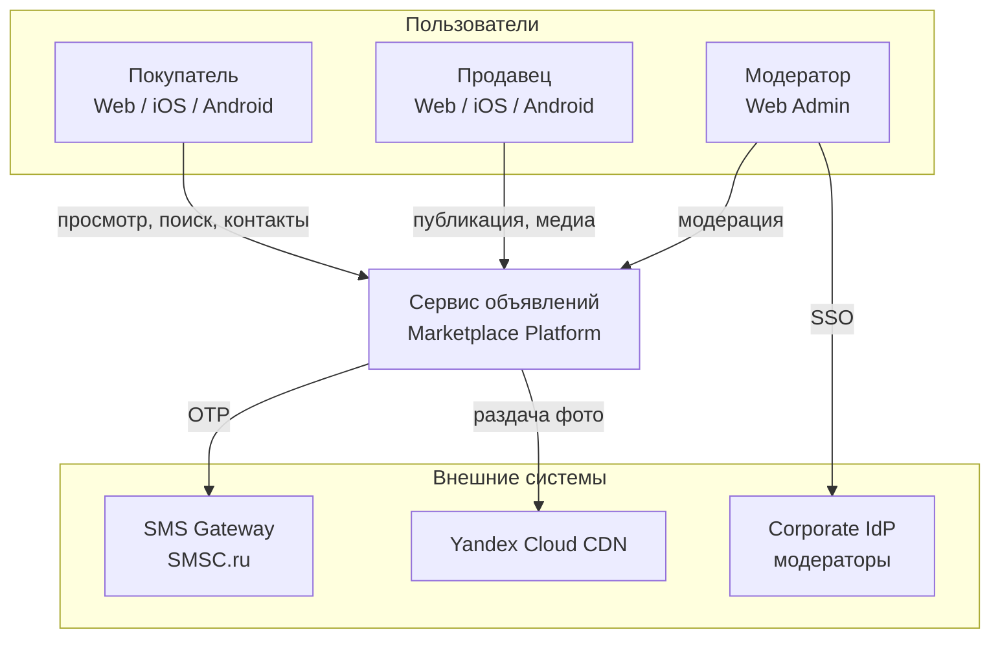
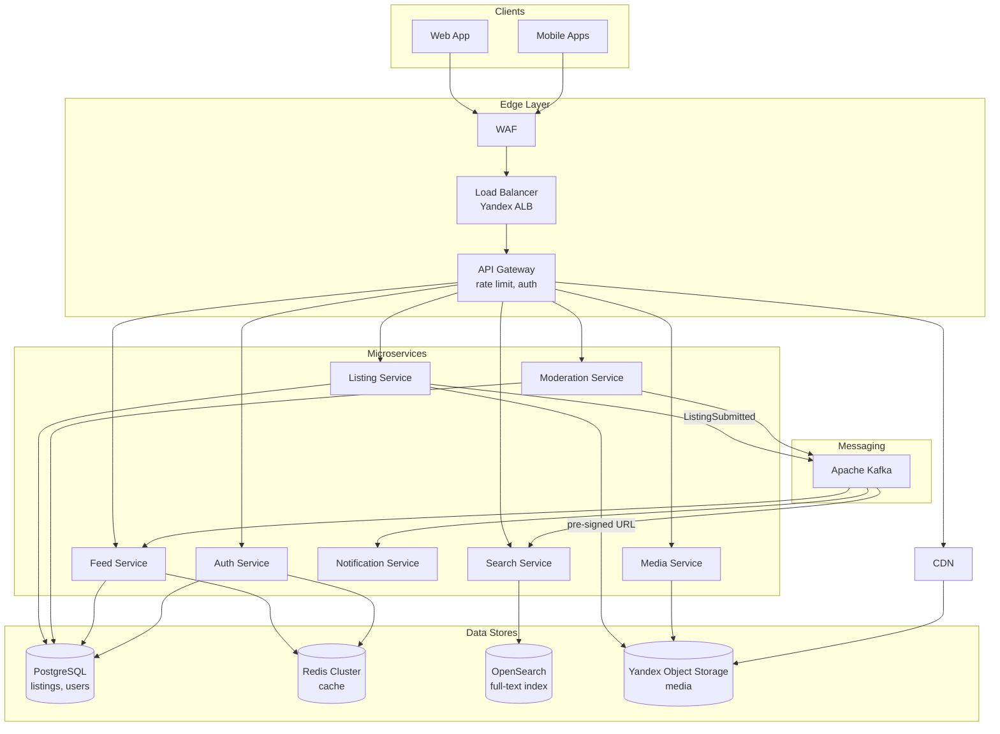
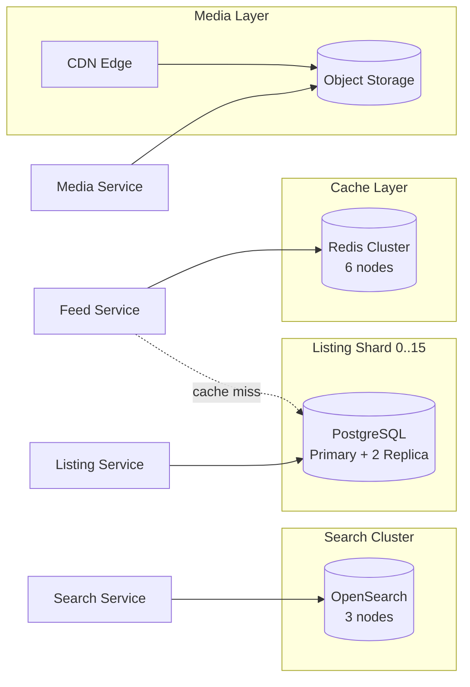
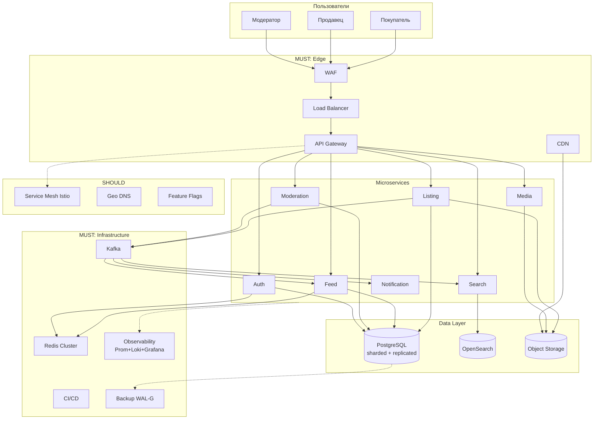

# Домашнее задание №2 — High Level Design

**Кейс:** Сервис объявлений (аналог Avito)  
**Входные данные:** [HW1.md](./HW1.md) (в этой же папке `HW/`) — ФТ, НФТ, расчёт нагрузки  
**Контекст:** Россия, 2026 год  
**Автор:** Аягжов

---

## Part 1 — Декомпозиция на сервисы и интеграции

### 1.1. Подход к декомпозиции

Используем **стратегический DDD** + **Event Storming** для выделения bounded contexts.

**Домен:** Маркетплейс объявлений C2C/B2C.

**Ключевые события (Event Storming):**

| Событие | Актор | Следствие |
|---------|-------|-----------|
| `UserRegistered` | Покупатель/Продавец | Создан профиль |
| `ListingDraftSaved` | Продавец | Черновик в БД |
| `MediaUploaded` | Продавец | Файл в Object Storage |
| `ListingSubmitted` | Продавец | Статус → `pending_moderation` |
| `ListingApproved` / `ListingRejected` | Модератор | Статус → `published` / `rejected` |
| `ListingPublished` | Система | Индексация в Search, инвалидация кэша Feed |
| `ListingViewed` | Покупатель | Аналитика (async) |
| `ContactRevealed` | Покупатель | Логирование (152-ФЗ audit) |

**Принцип разбиения:** один сервис = один bounded context = один владелец данных.  
На MVP не дробим избыточно: 7 сервисов — баланс между автономностью и операционной сложностью.

---

### 1.2. Сервисы и обоснование

| # | Сервис | Bounded Context | Ответственность | Почему отдельно |
|---|--------|-----------------|-----------------|-----------------|
| 1 | **API Gateway** | Edge | TLS termination, rate limiting, routing, auth check | Единая точка входа; защита от DDoS (NFR-SEC-03) |
| 2 | **Auth Service** | Identity | Регистрация, SMS OTP, JWT, сессии | ПДн (152-ФЗ), отдельный security perimeter |
| 3 | **Listing Service** | Catalog | CRUD объявлений, черновики, статусы, валидация | Write-path продавца; core domain |
| 4 | **Media Service** | Media | Upload фото, resize, CDN URLs | 128 ТБ/день — отдельный storage path, не грузим PostgreSQL |
| 5 | **Search Service** | Discovery | Full-text search, фильтры (категория, город, цена) | 19K RPS read; специализированный движок |
| 6 | **Feed Service** | Discovery | Лента объявлений, cursor-based pagination | Read-heavy; агрессивное кэширование |
| 7 | **Moderation Service** | Trust & Safety | Очередь модерации FIFO, approve/reject, audit trail | Отдельная роль, корпоративный IdP (FR-M-01) |
| 8 | **Notification Service** | Communication | Push/SMS о статусе модерации | Асинхронный канал; не блокирует core flow |

> **Примечание:** BFF (Backend-for-Frontend) для mobile/web можно добавить на фазе 1.5, если API Gateway не справляется с агрегацией.

---

### 1.3. Матрица интеграций

| От → К | Протокол | Sync/Async | Обоснование |
|--------|----------|------------|-------------|
| Client → API Gateway | HTTPS/REST | Sync | Пользователь ждёт ответ (NFR-P-02 ≤ 200ms) |
| API Gateway → Auth | REST + JWT validate | Sync | Каждый запрос требует проверки токена |
| API Gateway → Feed / Search / Listing | REST | Sync | Read/write операции пользователя |
| Listing → Media | REST (pre-signed URL) | Sync | Upload: клиент получает URL, грузит напрямую в S3 |
| Listing → Kafka (`ListingSubmitted`) | Kafka | **Async** | Модерация не блокирует продавца |
| Moderation → Kafka (`ListingApproved/Rejected`) | Kafka | **Async** | Декаплинг; Notification и Search подписаны |
| Search ← Kafka (`ListingPublished`) | Kafka consumer | **Async** | Eventual consistency индекса (~секунды) |
| Feed ← Kafka (`ListingPublished`) | Kafka consumer | **Async** | Инвалидация Redis-кэша |
| Notification ← Kafka | Kafka consumer | **Async** | Push/SMS не требуют мгновенного ответа |
| Moderation → Listing | REST (internal) | Sync | Обновление статуса объявления |
| Все сервисы → Auth | REST (token introspection) | Sync | Централизованная авторизация |

**Почему Kafka, а не RabbitMQ:**  
- Несколько consumer groups на одно событие (`ListingPublished` → Search + Feed + Analytics).  
- Replay при сбое индексации.  
- 300K+ событий/день — Kafka справляется с burst write.

**Почему не синхронная цепочка Listing → Moderation → Search:**  
Цепочка из 3 sync hops при 140 write RPS в пике даст latency > 2s и каскадные отказы (доступность = 0.999³ ≈ 0.997).

---

### 1.4. C4 — Level 1: System Context



---

### 1.5. C4 — Level 2: Container Diagram



---

## Part 2 — Выбор баз данных

### 2.1. Алгоритм выбора (11 вопросов курса)

Применяем к каждому типу данных из HW1.

#### Auth + User Profiles

| Вопрос | Ответ |
|--------|-------|
| Что за данные? | Пользователи: phone, email, profile, sessions |
| Формат? | Структурированный, схема стабильна |
| Отношения? | 1:N users → listings |
| Сценарии? | OLTP, CRUD, ACID (нельзя потерять УЗ) |
| Типовой проект? | Да |
| Функции из коробки? | Транзакции, FK, уникальность phone |
| Популярность / лицензия? | PostgreSQL — де-факто стандарт, open source |
| ЕРРП? | Postgres Pro сертифицирован |

**Выбор: PostgreSQL** (шард `user_id % N`)

---

#### Listings Metadata

| Вопрос | Ответ |
|--------|-------|
| Что за данные? | Объявления: title, price, category, geo, status |
| Сценарии? | Write ~140 RPS пик; read через Feed/Search |
| Отношения? | FK на users, 1:N media refs |
| Изменения? | Статусы, TTL 30 дней |

**Выбор: PostgreSQL** с партиционированием по `created_at` (месяц).  
Шардирование по `region_id` или `seller_id` при росте.

---

#### Search Index

| Вопрос | Ответ |
|--------|-------|
| Что за данные? | Inverted index, full-text, facets |
| Сценарии? | 19K RPS read, complex queries, ranking |
| ACID? | Не критично — source of truth в PostgreSQL |
| Отношения? | Денормализованный документ |

**Выбор: OpenSearch** (или Elasticsearch).  
Eventual consistency через Kafka consumer.

---

#### Feed Cache

| Вопрос | Ответ |
|--------|-------|
| Сценарии? | 19K RPS, latency < 200ms, TTL 60s |
| Данные? | Список listing_id + preview |

**Выбор: Redis Cluster** — cache-aside, key `feed:{city}:{category}:{cursor}`.

---

#### Media Files

| Вопрос | Ответ |
|--------|-------|
| Формат? | Бинарные объекты 5–10 МБ |
| Объём? | 128 ТБ/день |
| Сценарии? | Write 1.4 ГБ/с пик; read через CDN |

**Выбор: Yandex Object Storage (S3-compatible)** + CDN.  
Lifecycle: hot → cold через 30 дней.

---

#### Moderation Audit Log

| Вопрос | Ответ |
|--------|-------|
| Сценарии? | Append-only, compliance, 152-ФЗ |
| Запросы? | Редкие, по ID модератора/объявления |

**Выбор: PostgreSQL** (таблица `moderation_audit`) + архив в cold storage.  
Альтернатива на росте: ClickHouse для аналитики.

---

#### Event Bus

**Выбор: Apache Kafka** — `listing.events` topic, retention 7 дней, 3 partitions на MVP.

---

### 2.2. Сводная таблица

| Сервис | БД | Тип | Обоснование |
|--------|-----|-----|-------------|
| Auth | PostgreSQL + Redis | SQL + Cache | ACID для УЗ; Redis для OTP/session TTL |
| Listing | PostgreSQL | SQL | Транзакции, FK, партиционирование |
| Media | Object Storage (S3) | Object | 128 ТБ/день, CDN integration |
| Search | OpenSearch | Search engine | Full-text, facets, 19K RPS |
| Feed | Redis + PostgreSQL | Cache + SQL | Redis hot path; PG fallback |
| Moderation | PostgreSQL | SQL | FIFO queue, audit trail |
| Notification | PostgreSQL | SQL | Outbox pattern для доставки |
| Events | Kafka | Log | Async integration bus |

---

### 2.3. Репликация

| Хранилище | Стратегия | Обоснование |
|-----------|-----------|-------------|
| **PostgreSQL** | Single-Leader, 2 async replicas (Москва + СПб) | RPO ≤ 1 мин (NFR-A-02); read replicas для Listing read; failover через Patroni + etcd |
| **Redis** | Redis Cluster, 3 master + 3 replica | HA для кэша; потеря кэша = cache miss, не data loss |
| **OpenSearch** | 3 data nodes, replica shards = 1 | Поиск должен пережить падение 1 ноды |
| **Kafka** | 3 brokers, replication factor = 3, min.insync.replicas = 2 | Гарантия доставки событий модерации |
| **Object Storage** | Встроенная репликация ×3 (Yandex Cloud) | 128 ТБ/день — managed replication |

**Sync vs Async для PostgreSQL:**  
Async replication — не блокируем write path (140 RPS). RPO ~секунды при WAL shipping. Для критичных транзакций (публикация) — synchronous_commit = on на leader (компромисс latency vs durability).

---

### 2.4. Шардирование и партиционирование

#### Партиционирование (внутри одной БД)

```sql
-- listings: партиции по месяцу (auto-expire 30 дней → drop partition)
CREATE TABLE listings (
    id BIGSERIAL,
    seller_id BIGINT NOT NULL,
    created_at TIMESTAMPTZ NOT NULL,
    ...
) PARTITION BY RANGE (created_at);
```

#### Шардирование (между серверами)

| Данные | Ключ шарда | Кол-во шардов (старт) | Routing |
|--------|-----------|----------------------|---------|
| Users | `user_id % 16` | 16 | Application-level router |
| Listings | `seller_id % 16` | 16 | Co-locate с user shard |
| Search | `listing_id` hash | Managed by OpenSearch | — |

**Почему `seller_id`, а не `region`:**  
Продавец читает свои объявления (locality). Покупатель идёт в Search/Feed — они не ходят в шарды PostgreSQL напрямую.

**Hot spot mitigation:**  
Москва = 40% трафика. Search/Feed кэшируют; write шардирован по seller_id (равномернее, чем по geo).

---

### 2.5. C4 — Level 2 с Data Stores (дополнение)



---

## Part 3 — Инфраструктурные компоненты (MUST / SHOULD)

### 3.1. MUST — обязательные

| Компонент | Обоснование | Реализация |
|-----------|-------------|------------|
| **Load Balancer** | 20K RPS, горизонтальное масштабирование stateless сервисов (NFR-SC-01) | Yandex Application Load Balancer |
| **CDN** | 6 ГБ/с egress в пик; latency для медиа (NFR-SC-04) | Yandex Cloud CDN → Object Storage |
| **Кэш (Redis)** | 19K RPS read; без кэша PostgreSQL не выдержит (500–1000 QPS/инстанс) | Redis Cluster: feed, listing card, sessions |
| **IdP** | FR-M-01: модераторы через корпоративный IdP; OAuth 2.0 для всех ролей | Keycloak (on-prem в YC) |
| **WAF** | NFR-SEC-04: OWASP Top 10, AntiDDoS перед публичным API | Yandex Cloud WAF / EdgeЦентр |
| **CI/CD** | 6 месяцев TTM, 9 человек в команде; ручной деплой = риск | GitLab CI: build → test → scan → canary deploy |
| **Observability** | NFR-OBS-01..04: SLA breach alerts | OpenTelemetry Collector → Prometheus + Loki + Tempo → Grafana |
| **Резервное копирование** | RPO ≤ 1 мин, 152-ФЗ | WAL-G continuous backup → Yandex S3; daily snapshots |
| **Message Broker** | Async flow модерации, декаплинг Search/Feed | Kafka 3-broker cluster |
| **API Gateway** | Rate limiting (NFR-SEC-03), единая точка auth | Kong / Tyk |

---

### 3.2. SHOULD — рекомендуемые

| Компонент | Обоснование | Реализация |
|-----------|-------------|------------|
| **Service Mesh** | 8 микросервисов; retries, circuit breaker, mTLS | Istio (при >5 сервисов оправдан) |
| **Geo DNS** | NFR-SC-02: Multi-DC Москва + СПб | Yandex DNS → geo-routing |
| **Feature Flags** | Безопасный rollout (фаза 1.5: лайки, избранное) | Unleash (self-hosted) |
| **BFF** | Mobile и Web нужны разные агрегации API | Mobile BFF + Web BFF |
| **Dead Letter Queue** | Kafka: failed moderation events | DLQ topic + alert |
| **Rate Limiter (distributed)** | 20K RPS, защита Search от скрейпинга | Redis-based token bucket в API GW |

---

### 3.3. ADR-001: Архитектурный стиль — Микросервисы на MVP

**Контекст:** 10M DAU, 20K peak RPS, 3 роли, read-heavy.

**Решение:** Микросервисная архитектура (8 сервисов), не монолит.

**Причины:**
1. Read (Search, Feed) и Write (Listing, Media) масштабируются независимо.
2. Media path (128 ТБ/день) физически отделён от OLTP.
3. Команда 3 backend — по 2–3 сервиса на разработчика; автономные деплои.

**Отклонённые альтернативы:**
- **Монолит:** проще на старте, но 20K RPS read + 128 ТБ media в одном процессе — bottleneck.
- **Модульный монолит:** хорош для <1K RPS; не даёт независимого масштабирования Search.

**Trade-off:** Операционная сложность (K8s, Kafka, 5 типов storage) vs гибкость масштабирования.

---

## Итоговая схема HLD


