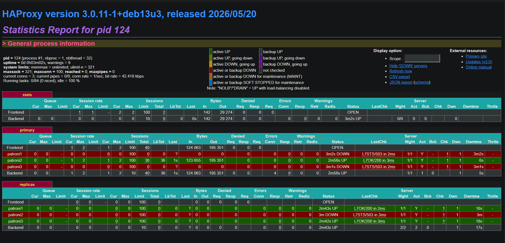
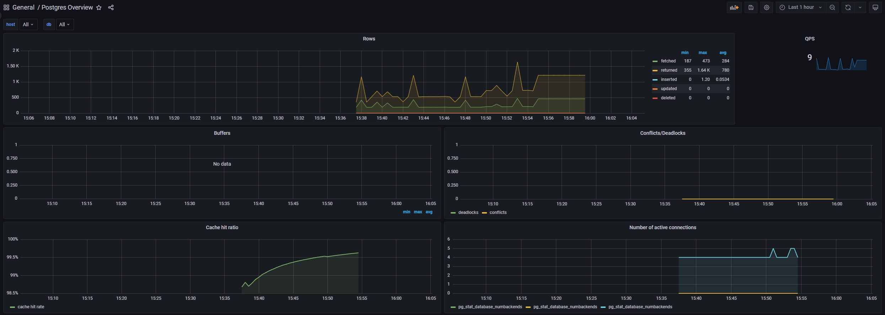

# Practice HW2 — Patroni PostgreSQL HA Cluster

**Автор:** Аягжов  
**Проект:** `code\postgres-ha`  
**ОС:** Windows (PowerShell)  
**Дата:** 21.06.2026

---

## 1. Архитектура кластера

### 1.1. Компоненты

```
                    ┌─────────────┐
                    │   Client    │
                    │ (psql /     │
                    │  traffic-gen)│
                    └──────┬──────┘
                           │
                    ┌──────▼──────┐
                    │  HAProxy    │ :5000 primary (write)
                    │  :7001 stats│ :5001 replicas (read)
                    └──────┬──────┘
           ┌───────────────┼───────────────┐
           │               │               │
    ┌──────▼──────┐ ┌──────▼──────┐ ┌──────▼──────┐
    │  patroni1   │ │  patroni2   │ │  patroni3   │
    │  PostgreSQL │ │  PostgreSQL │ │  PostgreSQL │
    │  + Patroni  │ │  + Patroni  │ │  + Patroni  │
    └──────┬──────┘ └──────┬──────┘ └──────┬──────┘
           │               │               │
           └───────────────┼───────────────┘
                           │
              ┌────────────┼────────────┐
              │            │            │
       ┌──────▼───┐ ┌──────▼───┐ ┌──────▼───┐
       │  etcd1   │ │  etcd2   │ │  etcd3   │
       │  (DCS)   │ │  (DCS)   │ │  (DCS)   │
       └──────────┘ └──────────┘ └──────────┘
```

### 1.2. Роли компонентов

| Компонент | Роль | Аналогия |
|-----------|------|----------|
| **etcd** | DCS (Distributed Configuration Store). Хранит leader key, состояние кластера. Raft-кворум 2/3 | «Мозг» — кто сейчас master |
| **Patroni** | Sidecar на каждой ноде PG. Борется за leader key в etcd. Держит ключ → primary; нет ключа → replica | «Выборы» лидера |
| **HAProxy** | Опрашивает Patroni REST API (`/primary`, `/replica`), маршрутизирует write на leader, read на replicas | «Диспетчер» для клиента |
| **PostgreSQL** | Данные. Streaming replication primary → standby | «Склад» |

### 1.3. Порты

| Порт | Назначение |
|------|------------|
| **5002** (host) → 5000 (HAProxy) | Write (master) |
| **5001** (host) → 5001 (HAProxy) | Read (replicas) |
| **7001** | HAProxy stats UI |
| **9090** | Prometheus |
| **3000** | Grafana |
| **9187** | postgres-exporter |

Внутри docker-сети: master = `haproxy:5000`, replica = `haproxy:5001`.

---

## 2. Состав кластера (`patronictl list`)

```powershell
docker exec demo-patroni1 python3 /patronictl.py list
```

| Member | Host | Role | State | TL | Lag |
|--------|------|------|-------|----|-----|
| patroni1 | 172.21.0.8 | Replica | streaming | 1 | 0 |
| patroni2 | 172.21.0.6 | **Leader** | running | 1 | — |
| patroni3 | 172.21.0.4 | Replica | streaming | 1 | 0 |

Полный вывод сохранён в `screenshots/patronictl-list.txt`.

**Выводы:**
- Один **Leader** (patroni2) — единственный принимает write
- Два **Replica** в состоянии `streaming` — синхронная репликация WAL
- `Lag = 0` — реплики не отстают

---

## 3. HAProxy Dashboard

```powershell
Invoke-WebRequest -Uri http://localhost:7001/ -UseBasicParsing | Select-Object StatusCode
# StatusCode: 200
```



**Выводы:**
- Backend **primary** — UP только у текущего leader (patroni2), остальные DOWN с `503` (ожидаемо: не `/primary`)
- Backend **replicas** — UP у patroni1 и patroni3, patroni2 DOWN (он leader, не replica)
- HAProxy автоматически переключает backends при смене роли через confd + Patroni REST API

---

## 4. Подключение и SQL-скрипт

### 4.1. Master (write)

```
Host: localhost (или haproxy внутри сети)
Port: 5002 (host) / 5000 (docker-сеть)
Database: postgres
User: postgres
Password: postgres
```

### 4.2. Replica (read)

```
Port: 5001 (host и docker-сеть)
(остальное то же)
```

### 4.3. SQL

Скрипт: `code\postgres-ha\init-schema.sql`

Пролив на master (важно: порт **5000** внутри docker-сети, не 5001):

```powershell
Get-Content init-schema.sql | docker exec -i -e PGPASSWORD=postgres demo-patroni1 psql -U postgres -h haproxy -p 5000 -d postgres
```

Результат: `CREATE TABLE` ×2, `CREATE INDEX` ×3, `INSERT 0 3`, `INSERT 0 2` — без ERROR.

Проверка репликации:

```powershell
docker exec -e PGPASSWORD=postgres demo-patroni1 psql -U postgres -h haproxy -p 5000 -d postgres -c "SELECT count(*) FROM events;"
docker exec -e PGPASSWORD=postgres demo-patroni1 psql -U postgres -h haproxy -p 5001 -d postgres -c "SELECT count(*) FROM events;"
```

| Где | count(*) |
|-----|----------|
| Master (5000 / localhost:5002) | **2** |
| Replica (5001 / localhost:5001) | **2** |

Данные на replica совпали с master — репликация работает.

---

## 5. Traffic Generator

```powershell
pip install psycopg2-binary
cd code\postgres-ha
python traffic-generator.py
```

**Поведение:**
- Каждую 1s: INSERT в `events`
- Каждые 2s: SELECT последних 3 записей (`READ check`)
- Подключается к `localhost:5002` (HAProxy primary / write endpoint)

**Наблюдения:**
- Старт: `[15:53:23] CONNECTED to Master Node`
- ID событий монотонно растут: 1 → 3 → 5 → … → 59 (первая сессия, ~1 мин)
- READ check показывает последние 3 ID без расхождений
- После ~1 мин генерации: `count(*)` на master и replica = **59** (оба порта)
- Вторая сессия (во время chaos): IDs до **379+**, INSERT продолжался, пока etcd/HAProxy были доступны

---

## 6. Chaos Engineering — тесты отказоустойчивости

`traffic-generator.py` работал в отдельном окне во время тестов.

### 6.1. Выключить реплику (не лидера)

```powershell
docker stop demo-patroni2   # replica, leader = patroni3
```

**Наблюдения:**
- Generator: INSERT продолжался без ошибок
- `patronictl list`: patroni2 = `stopped`, patroni3 = Leader, patroni1 = streaming

```powershell
docker start demo-patroni2
Start-Sleep -Seconds 30
docker exec demo-patroni1 python3 /patronictl.py list
```

После восстановления — все 3 ноды `streaming` / Leader, lag 0 (см. `screenshots/patronictl-recovery.txt`):

| Member | Role | State | TL |
|--------|------|-------|-----|
| patroni1 | Replica | streaming | 2 |
| patroni2 | Replica | streaming | 2 |
| patroni3 | **Leader** | running | 2 |

---

### 6.2. Выключить лидера (failover)

Первый failover произошёл при остановке **patroni2** (был Leader):

```powershell
docker stop demo-patroni2
docker start demo-patroni2
```

**Наблюдения:**
- Leader сменился: **patroni2 → patroni3**
- Timeline увеличился: TL **1 → 2**
- Generator: кратковременный `CONNECTION LOST`, затем `CONNECTED to Master Node` (~15:56:52)
- После failover INSERT возобновился

Остановка **patroni1** (replica) при leader = patroni3:

```powershell
docker stop demo-patroni1
```

| patroni1 | stopped |
| patroni2 | Replica, streaming |
| patroni3 | **Leader**, running |

Generator продолжал INSERT — падение replica не влияет на write.

```powershell
docker start demo-patroni1
```

Состояние при остановленной patroni1 (`screenshots/patronictl-failover.txt`):

| Member | Role | State |
|--------|------|-------|
| patroni1 | Replica | **stopped** |
| patroni2 | Replica | streaming |
| patroni3 | **Leader** | running |

---

### 6.3. Выключить etcd ноды

**Одна etcd:**

```powershell
docker stop demo-etcd1
docker exec demo-patroni1 python3 /patronictl.py list
```

**Наблюдения:**
- Кворум 2/3 сохранён — кластер работает
- `patronictl` выдал WARNING про etcd1, но список нод получен
- patroni3 = Leader, реплики streaming
- Generator: INSERT продолжался

**Две etcd (потеря кворума):**

```powershell
docker stop demo-etcd1
docker stop demo-etcd2
```

**Наблюдения:**
- `patronictl list` → `Etcd is not responding properly`
- Generator (16:02:13): `CONNECTION LOST (Failover in progress?)`
- Затем ~40 сек: `session is read-only`, `server closed the connection`
- Failover через DCS невозможен без кворума — ожидаемое поведение Patroni

```powershell
docker start demo-etcd1 demo-etcd2
Start-Sleep -Seconds 15
```

---

### 6.4. Выключить HAProxy

```powershell
docker stop demo-haproxy
```

**Наблюдения:**
- Generator: `Connection refused` на `localhost:5002` (с 16:05:24)
- Клиент полностью потерял доступ к БД, хотя PostgreSQL и Patroni продолжали работать
- `patronictl` внутри контейнера при этом доступен

**Как избежать в продакшене:**
1. **2+ HAProxy** с Keepalived (VIP floating)
2. **DNS round-robin** на несколько HAProxy
3. **Patroni REST API** / service discovery в приложении
4. Managed PostgreSQL (Yandex Cloud / AWS RDS) — LB встроен

---

## 7. Сводная таблица chaos-тестов

| Тест | Downtime write | Данные потеряны? | Автовосстановление? | Комментарий |
|------|----------------|------------------|---------------------|-------------|
| Replica down (patroni2) | 0 | Нет | Да (~30 сек) | INSERT без пауз |
| Leader down (patroni2) | ~10–20 сек | Нет | Да | Failover → patroni3, TL=2 |
| Replica down (patroni1) | 0 | Нет | Да | Leader patroni3 не затронут |
| 1 etcd down | 0 | Нет | Да | Кворум 2/3, WARNING в логах |
| 2 etcd down | ~3 мин | Нет (данные на disk) | После `start etcd` | patronictl недоступен, generator: read-only / connection lost |
| HAProxy down | до restart | Нет | Ручной `docker start` | Connection refused, PG жив |

---

## 8. Grafana

http://localhost:3000 (admin/admin)



**Наблюдения (15:37–16:00, во время generator + chaos-тестов):**
- **QPS** ~9 — нагрузка от traffic-generator (INSERT + READ)
- **Rows inserted** — ступенчатый рост (до ~1.2/s на пиках), **returned/fetched** — READ check каждые 2s
- **Active connections** — 4–5 (generator + psql + exporter)
- **Cache hit ratio** — ~98.7% → 99.3%, без деградации
- **Deadlocks / conflicts** — 0
- Во время failover и падения etcd видны кратковременные провалы активности (согласуется с логами generator §5–6)

---

## Выводы

1. **Patroni + etcd** обеспечивают автоматический failover: при падении leader (patroni2) leader стал patroni3 за ~10–20 сек без потери данных.
2. **Streaming replication** работает: после `init-schema.sql` count=2 на master и replica; после generator — count=59 на обоих портах.
3. **HAProxy** — единая точка входа для клиента: при его падении приложение полностью теряет доступ к БД → нужен HA для самого HAProxy.
4. **etcd кворум критичен**: при 1/3 ноде кластер жив; при потере кворума Patroni не может управлять failover, generator получает read-only / connection errors.
5. Падение **replica** не влияет на write — INSERT продолжается через leader.
