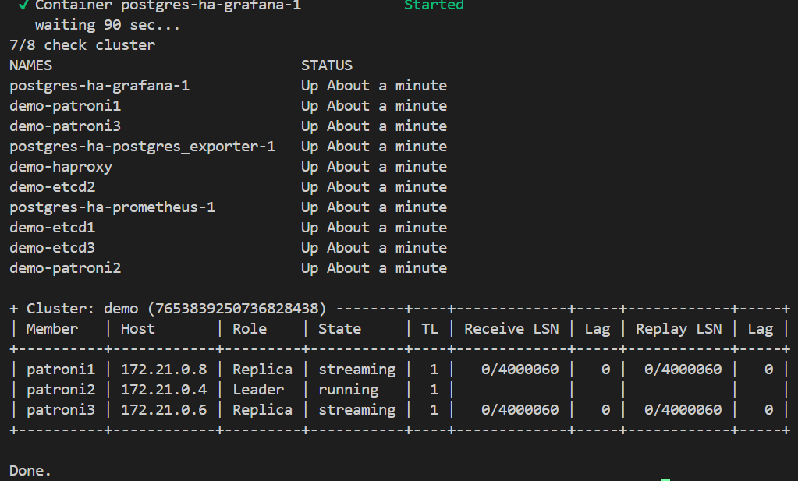

# Practice HW2 — Patroni PostgreSQL HA Cluster

**Автор:** Алексей Ягжов  
**Проект:** `code\postgres-ha`  
**ОС:** Windows (PowerShell)  
**Дата:** 21.06.2026

---

## 1. Архитектура кластера

### 1.1. Компоненты

```
                    ┌─────────────┐
                    │   Client    │
                    │ (psql /     │
                    │  traffic-gen)│
                    └──────┬──────┘
                           │
                    ┌──────▼──────┐
                    │  HAProxy    │ :5000 primary (write)
                    │  :7001 stats│ :5001 replicas (read)
                    └──────┬──────┘
           ┌───────────────┼───────────────┐
           │               │               │
    ┌──────▼──────┐ ┌──────▼──────┐ ┌──────▼──────┐
    │  patroni1   │ │  patroni2   │ │  patroni3   │
    │  PostgreSQL │ │  PostgreSQL │ │  PostgreSQL │
    │  + Patroni  │ │  + Patroni  │ │  + Patroni  │
    └──────┬──────┘ └──────┬──────┘ └──────┬──────┘
           │               │               │
           └───────────────┼───────────────┘
                           │
              ┌────────────┼────────────┐
              │            │            │
       ┌──────▼───┐ ┌──────▼───┐ ┌──────▼───┐
       │  etcd1   │ │  etcd2   │ │  etcd3   │
       │  (DCS)   │ │  (DCS)   │ │  (DCS)   │
       └──────────┘ └──────────┘ └──────────┘
```

### 1.2. Роли компонентов

| Компонент | Роль | Аналогия |
|-----------|------|----------|
| **etcd** | DCS (Distributed Configuration Store). Хранит leader key, состояние кластера. Raft-кворум 2/3 | «Мозг» — кто сейчас master |
| **Patroni** | Sidecar на каждой ноде PG. Борется за leader key в etcd. Держит ключ → primary; нет ключа → replica | «Выборы» лидера |
| **HAProxy** | Опрашивает Patroni REST API (`/primary`, `/replica`), маршрутизирует write на leader, read на replicas | «Диспетчер» для клиента |
| **PostgreSQL** | Данные. Streaming replication primary → standby | «Склад» |

### 1.3. Порты

| Порт | Назначение |
|------|------------|
| **5002** (host) → 5000 (HAProxy) | Write (master) |
| **5001** (host) → 5001 (HAProxy) | Read (replicas) |
| **7001** | HAProxy stats UI |
| **9090** | Prometheus |
| **3000** | Grafana |
| **9187** | postgres-exporter |

Внутри docker-сети: master = `haproxy:5000`, replica = `haproxy:5001`.

---

## 2. Состав кластера (`patronictl list`)

```powershell
docker exec demo-patroni1 python3 /patronictl.py list
```

**Вывод терминала:**

```
+ Cluster: demo (7653826753696423958) --------+----+-------------+-----+------------+-----+
| Member   | Host       | Role    | State     | TL | Receive LSN | Lag | Replay LSN | Lag |
+----------+------------+---------+-----------+----+-------------+-----+------------+-----+
| patroni1 | 172.21.0.8 | Replica | streaming |  1 |   0/40456D8 |   0 |  0/40456D8 |   0 |
| patroni2 | 172.21.0.6 | Leader  | running   |  1 |             |     |            |     |
| patroni3 | 172.21.0.4 | Replica | streaming |  1 |   0/40456D8 |   0 |  0/40456D8 |   0 |
+----------+------------+---------+-----------+----+-------------+-----+------------+-----+
```



**Выводы:**
- Один **Leader** (patroni2) — единственный принимает write
- Два **Replica** в состоянии `streaming` — синхронная репликация WAL
- `Lag = 0` — реплики не отстают

---

## 3. HAProxy Dashboard

```powershell
Invoke-WebRequest -Uri http://localhost:7001/ -UseBasicParsing | Select-Object StatusCode
```

```
StatusCode : 200
```


**Выводы:**
- Backend **primary** — UP только у текущего leader (patroni2, `L7OK/200`), остальные DOWN с `503`
- Backend **replicas** — UP у patroni1 и patroni3, patroni2 DOWN (он leader, не replica)
- HAProxy автоматически переключает backends при смене роли через confd + Patroni REST API

---

## 4. Подключение и SQL-скрипт

### 4.1. Master (write)

```
Host: localhost (или haproxy внутри сети)
Port: 5002 (host) / 5000 (docker-сеть)
Database: postgres
User: postgres
Password: postgres
```

### 4.2. Replica (read)

```
Port: 5001 (host и docker-сеть)
(остальное то же)
```

### 4.3. SQL

Скрипт: `code\postgres-ha\init-schema.sql`

Сначала ошибочно пролил на **replica** (порт 5001) — получил read-only:

```powershell
Get-Content init-schema.sql | docker exec -i -e PGPASSWORD=postgres demo-patroni1 psql -U postgres -h haproxy -p 5001 -d postgres
```

```
ERROR:  cannot execute CREATE TABLE in a read-only transaction
ERROR:  cannot execute CREATE TABLE in a read-only transaction
ERROR:  relation "owners" does not exist
ERROR:  relation "events" does not exist
```

Правильно — на **master** (порт 5000):

```powershell
Get-Content init-schema.sql | docker exec -i -e PGPASSWORD=postgres demo-patroni1 psql -U postgres -h haproxy -p 5000 -d postgres
```

```
CREATE TABLE
CREATE TABLE
CREATE INDEX
CREATE INDEX
CREATE INDEX
COMMENT
...
INSERT 0 3
INSERT 0 2
```

Проверка репликации:

```powershell
docker exec -e PGPASSWORD=postgres demo-patroni1 psql -U postgres -h haproxy -p 5000 -d postgres -c "SELECT count(*) FROM events;"
docker exec -e PGPASSWORD=postgres demo-patroni1 psql -U postgres -h haproxy -p 5001 -d postgres -c "SELECT count(*) FROM events;"
```

```
 events_on_master
------------------
                2
(1 row)

 events_on_replica
-------------------
                 2
(1 row)
```

| Где | count(*) |
|-----|----------|
| Master (5000 / localhost:5002) | **2** |
| Replica (5001 / localhost:5001) | **2** |

Данные на replica совпали с master — репликация работает.

---

## 5. Traffic Generator

```powershell
pip install psycopg2-binary
python traffic-generator.py
```

**Вывод терминала (окно с generator, старт):**

```
--- STARTING LOAD GENERATOR ON PORT 5002 ---

[15:53:23] CONNECTED to Master Node
[15:53:23] INSERT: logout by ...
READ check (Last 3 IDs): [3, 2, 1]
[15:53:24] INSERT: login by ...
[15:53:25] INSERT: click by ...
READ check (Last 3 IDs): [5, 4, 3]
...
[15:54:20] INSERT: view_page by ...
READ check (Last 3 IDs): [59, 58, 57]
```

После ~1 мин генерации:

```powershell
docker exec -e PGPASSWORD=postgres demo-patroni1 psql -U postgres -h haproxy -p 5000 -d postgres -c "SELECT count(*) FROM events;"
docker exec -e PGPASSWORD=postgres demo-patroni1 psql -U postgres -h haproxy -p 5001 -d postgres -c "SELECT count(*) FROM events;"
```

```
 count
-------
    59
(1 row)

 count
-------
    59
(1 row)
```

**Наблюдения:**
- Пишет на `localhost:5002` (HAProxy primary), читает через `READ check` с master
- ID монотонно растут, READ check показывает последние 3 ID без расхождений
- count=59 на master и replica — репликация в реальном времени работает

---

## 6. Chaos Engineering — тесты отказоустойчивости

`traffic-generator.py` работал в отдельном окне PowerShell во время chaos-тестов.

### 6.1. Выключить реплику (не лидера)

```powershell
docker stop demo-patroni2   # replica, leader = patroni3
docker exec demo-patroni1 python3 /patronictl.py list
```

```
| patroni1 | 172.21.0.8 | Replica | streaming |  2 |   0/40A3590 |   0 |  0/40A3590 |   0 |
| patroni2 | 172.21.0.6 | Replica | stopped   |    |     unknown |     |    unknown |     |
| patroni3 | 172.21.0.4 | Leader  | running   |  2 |             |     |            |     |
```

Generator — INSERT продолжался без ошибок:

```
[15:58:10] INSERT: view_page by ...
[15:58:11] INSERT: click by ...
READ check (Last 3 IDs): [141, 140, 139]
```

Восстановление:

```powershell
docker start demo-patroni2
Start-Sleep -Seconds 30
docker exec demo-patroni1 python3 /patronictl.py list
```

```
| patroni1 | 172.21.0.8 | Replica | streaming |  2 |   0/40B14D0 |   0 |  0/40B14D0 |   0 |
| patroni2 | 172.21.0.6 | Replica | streaming |  2 |   0/40B1678 |   0 |  0/40B1678 |   0 |
| patroni3 | 172.21.0.4 | Leader  | running   |  2 |             |     |            |     |
```

---

### 6.2. Выключить лидера (failover)

```powershell
docker stop demo-patroni2   # был Leader
docker start demo-patroni2
Start-Sleep -Seconds 30
docker exec demo-patroni1 python3 /patronictl.py list
```

**До failover** (patroni2 = Leader, TL=1):

```
| patroni2 | 172.21.0.6 | Leader  | running   |  1 |             |     |            |     |
```

**После failover** (patroni3 = Leader, TL=2):

```
| patroni1 | 172.21.0.8 | Replica | streaming |  2 |   0/4098840 |   0 |  0/4098840 |   0 |
| patroni2 | 172.21.0.6 | Replica | streaming |  2 |   0/4098840 |   0 |  0/4098840 |   0 |
| patroni3 | 172.21.0.4 | Leader  | running   |  2 |             |     |            |     |
```

Generator при падении leader:

```
[15:55:11] Connection failed: connection to server at "localhost" (::1), port 5002 failed: server closed the connection unexpectedly
[15:55:13] Connection failed: ...
```

После failover — переподключился:

```
[15:56:52] CONNECTED to Master Node
[15:56:52] INSERT: login by ...
READ check (Last 3 IDs): [69, 59, 58]
```

Остановка **patroni1** (replica, leader = patroni3):

```powershell
docker stop demo-patroni1
docker exec demo-patroni2 python3 /patronictl.py list
```

```
| patroni1 | 172.21.0.8 | Replica | stopped   |    |     unknown |     |    unknown |     |
| patroni2 | 172.21.0.6 | Replica | streaming |  2 |   0/40B7708 |   0 |  0/40B7708 |   0 |
| patroni3 | 172.21.0.4 | Leader  | running   |  2 |             |     |            |     |
```

Generator продолжал INSERT — падение replica не влияет на write.

---

### 6.3. Выключить etcd ноды

**Одна etcd (кворум 2/3 сохранён):**

```powershell
docker stop demo-etcd1
docker exec demo-patroni1 python3 /patronictl.py list
```

```
2026-06-21 13:01:35,033 - WARNING - failed to resolve host etcd1: [Errno -5] No address associated with hostname
...
| patroni1 | 172.21.0.8 | Replica | streaming |  2 |   0/40CC8B8 |   0 |  0/40CC8B8 |   0 |
| patroni2 | 172.21.0.6 | Replica | streaming |  2 |   0/40CC8B8 |   0 |  0/40CC8B8 |   0 |
| patroni3 | 172.21.0.4 | Leader  | running   |  2 |             |     |            |     |
```

Generator — INSERT без пауз (~15:59–16:01).

**Две etcd (потеря кворума):**

```powershell
docker stop demo-etcd1
docker stop demo-etcd2
docker exec demo-patroni1 python3 /patronictl.py list
```

```
2026-06-21 13:02:06,496 - ERROR - get_cluster
...
etcd.EtcdConnectionFailed: No more machines in the cluster
...
patroni.dcs.etcd3.Etcd3Error: Etcd is not responding properly
```

Generator (16:02:13 — одновременно с падением etcd):

```
[16:02:12] INSERT: click by ...
READ check (Last 3 IDs): [379, 378, 377]

[16:02:13] CONNECTION LOST (Failover in progress?): could not receive data from server: Software caused connection abort

[16:02:14] Connection failed: connection to server at "localhost" (::1), port 5002 failed: session is read-only
[16:02:15] Connection failed: ... session is read-only
...
[16:02:19] Connection failed: ... server closed the connection unexpectedly
```

---

### 6.4. Выключить HAProxy

```powershell
docker stop demo-haproxy
```

Generator (16:05:24):

```
[16:05:24] Connection failed: connection to server at "localhost" (::1), port 5002 failed: Connection refused (0x0000274D/10061)
        Is the server running on that host and accepting TCP/IP connections?
connection to server at "localhost" (127.0.0.1), port 5002 failed: Connection refused (0x0000274D/10061)
```

**Как избежать в продакшене:**
1. **2+ HAProxy** с Keepalived (VIP floating)
2. **DNS round-robin** на несколько HAProxy
3. **Patroni REST API** / service discovery в приложении
4. Managed PostgreSQL (Yandex Cloud / AWS RDS) — LB встроен

---

## 7. Сводная таблица chaos-тестов

| Тест | Downtime write | Данные потеряны? | Автовосстановление? | Комментарий |
|------|----------------|------------------|---------------------|-------------|
| Replica down (patroni2) | 0 | Нет | Да (~30 сек) | INSERT без пауз |
| Leader down (patroni2) | ~10–20 сек | Нет | Да | Failover → patroni3, TL=2 |
| Replica down (patroni1) | 0 | Нет | Да | Leader patroni3 не затронут |
| 1 etcd down | 0 | Нет | Да | Кворум 2/3, WARNING в логах |
| 2 etcd down | ~3 мин | Нет (данные на disk) | После `start etcd` | patronictl недоступен, generator: read-only / connection lost |
| HAProxy down | до restart | Нет | Ручной `docker start` | Connection refused, PG жив |

---

## 8. Grafana

http://localhost:3000 (admin/admin)


**Наблюдения (15:37–16:00, во время generator + chaos-тестов):**
- **QPS** ~9 — нагрузка от traffic-generator (INSERT + READ)
- **Rows inserted** — ступенчатый рост, **returned/fetched** — READ check каждые 2s
- **Active connections** — 4–5 (generator + psql + exporter)
- **Cache hit ratio** — ~98.7% → 99.3%, без деградации
- **Deadlocks / conflicts** — 0

---

## Выводы

1. **Patroni + etcd** обеспечивают автоматический failover: при падении leader (patroni2) leader стал patroni3 за ~10–20 сек без потери данных.
2. **Streaming replication** работает: после `init-schema.sql` count=2 на master и replica; после generator — count=59 на обоих портах.
3. **HAProxy** — единая точка входа для клиента: при его падении приложение полностью теряет доступ к БД → нужен HA для самого HAProxy.
4. **etcd кворум критичен**: при 1/3 ноде кластер жив; при потере кворума Patroni не может управлять failover, generator получает read-only / connection errors.
5. Падение **replica** не влияет на write — INSERT продолжается через leader.
